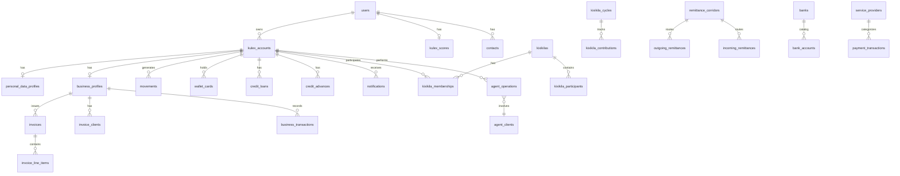

# Estrutura de Base de Dados — Kulex (estado actual da app)

Este documento descreve **como seria a estrutura de base de dados** implícita no código actual da aplicação Kulex (Expo / React Native). Os dados hoje vivem maioritariamente em `constants/` e `lib/` como mocks em memória; o esquema abaixo reflecte o **modelo de domínio** que a app já implementa nos ecrãs e fluxos.

---

## Convenções

| Aspecto | Convenção |
|---------|-----------|
| Moeda principal | AOA (`kz`) |
| Valores internos | Inteiros em cêntimos ou strings de dígitos (`amountDigits`) |
| Identificadores públicos | `membership_id` no formato `KLX-{8 dígitos}` |
| Referências de operação | Prefixos por domínio: `TW-*` (transferências), `RMX-*` (remessas), etc. |
| Tipos de conta | `personal`, `agent`, `business` |
| Verificação | KYC (pessoal/agente), KYB (empresa) — estados: `Verificado`, `Pendente` |
| PIN | 4 dígitos (signup e operações sensíveis) |
| Telefone (Angola) | 9 dígitos, tipicamente a começar por `9` |

---

## Diagrama de relações (visão geral)

---

## 1. Identidade e contas

### `users`

Utilizador autenticado (implícito no signup; não existe tipo dedicado hoje).

| Coluna | Tipo | Notas |
|--------|------|-------|
| `id` | UUID | PK |
| `email` | VARCHAR | Único |
| `phone` | VARCHAR(20) | Com contexto de país |
| `pin_hash` | VARCHAR | PIN de 4 dígitos |
| `full_name` | VARCHAR | |
| `nickname` | VARCHAR | Opcional |
| `birth_date` | DATE | |
| `gender` | VARCHAR | |
| `nationality` | VARCHAR | |
| `id_document_type` | ENUM | `bi`, `passaporte`, `certidao_comercial` |
| `id_number` | VARCHAR | |
| `nif` | VARCHAR | |
| `address` | TEXT | |
| `country_code` | CHAR(2) | ISO-3166 |
| `kyc_status` | ENUM | `pendente`, `verificado` |
| `avatar_url` | VARCHAR | Opcional |
| `created_at` | TIMESTAMPTZ | |
| `updated_at` | TIMESTAMPTZ | |

---

### `kulex_accounts`

Conta operacional na Kulex (pessoal, agente ou empresa). Uma pessoa pode ter várias.

| Coluna | Tipo | Notas |
|--------|------|-------|
| `id` | VARCHAR | PK — ex.: `naym-personal` |
| `user_id` | UUID | FK → `users` |
| `kind` | ENUM | `personal`, `agent`, `business` |
| `name` | VARCHAR | Nome de exibição |
| `membership_id` | VARCHAR | Único — ex.: `KLX-48291037` |
| `balance_cents` | BIGINT | Saldo principal em cêntimos |
| `initials` | VARCHAR(4) | UI |
| `color` | CHAR(7) | UI |
| `avatar_url` | VARCHAR | Opcional |
| `status` | ENUM | `active`, `suspended`, `pending_kyc` |
| `created_at` | TIMESTAMPTZ | |

**Contas de demonstração actuais:**

| id | kind | membership_id |
|----|------|---------------|
| `naym-personal` | personal | KLX-48291037 |
| `naym-agent` | agent | KLX-39102756 |
| `kulex-business` | business | KLX-77204519 |

---

### `my_accounts` (sub-carteiras internas)

Carteiras lógicas para transferências entre «Minhas Contas» (não são contas Kulex separadas no backend real, mas a app modela-as assim).

| Coluna | Tipo | Notas |
|--------|------|-------|
| `id` | ENUM | `pessoal`, `agente`, `poupanca` |
| `kulex_account_id` | VARCHAR | FK → `kulex_accounts` |
| `name` | VARCHAR | Ex.: Kulex Pessoal, Poupança |
| `balance_cents` | BIGINT | |
| `icon` | VARCHAR | Nome do ícone |

---

### `personal_data_profiles`

Perfil detalhado por conta (ecrã Dados Pessoais).

| Coluna | Tipo | Notas |
|--------|------|-------|
| `account_id` | VARCHAR | PK/FK → `kulex_accounts` |
| `email` | VARCHAR | |
| `phone` | VARCHAR | |
| `full_name` | VARCHAR | |
| `nickname` | VARCHAR | |
| `birth_date` | DATE | |
| `gender` | VARCHAR | |
| `nationality` | VARCHAR | |
| `id_document_type` | VARCHAR | |
| `id_number` | VARCHAR | |
| `nif` | VARCHAR | |
| `address` | TEXT | |
| `membership_id` | VARCHAR | Denormalizado |
| `kyc_status` | VARCHAR | |

---

### `business_profiles`

Perfil KYB da conta empresa.

| Coluna | Tipo | Notas |
|--------|------|-------|
| `account_id` | VARCHAR | PK/FK → `kulex_accounts` |
| `company_name` | VARCHAR | |
| `trade_name` | VARCHAR | |
| `location` | VARCHAR | |
| `nif` | VARCHAR | |
| `business_type` | ENUM | `individual`, `company` |
| `kyb_status` | ENUM | `pendente`, `verificado` |
| `simplified_invoices_used` | INT | Limite anual: 300 |
| `simplified_invoices_limit` | INT | Default 300 |
| `created_at` | TIMESTAMPTZ | |

---

## 2. Livro razão e movimentos

### `movements`

Extrato de movimentos por conta (`constants/movimentos.ts`, `lib/movimentos.ts`).

| Coluna | Tipo | Notas |
|--------|------|-------|
| `id` | VARCHAR | PK |
| `account_id` | VARCHAR | FK → `kulex_accounts` |
| `title` | VARCHAR | Ex.: Remessa, Pagamento Serviço |
| `amount_cents` | BIGINT | Positivo; sinal via `type` |
| `type` | ENUM | `credit`, `debit` |
| `iso_date` | DATE | Filtros |
| `reference` | VARCHAR | Ex.: `TW-2026-004821` |
| `status` | VARCHAR | Ex.: Concluído |
| `channel` | VARCHAR | Ex.: App Kulex |
| `category` | VARCHAR | remessas, cartões, transferências, serviços, crédito… |
| `type_label` | VARCHAR | Rótulo de exibição |
| `created_at` | TIMESTAMPTZ | |

---

### `payment_transactions` (agregador genérico)

Tabela unificadora sugerida para todos os fluxos de pagamento/transferência que hoje estão fragmentados.

| Coluna | Tipo | Notas |
|--------|------|-------|
| `id` | UUID | PK |
| `account_id` | VARCHAR | FK |
| `movement_id` | VARCHAR | FK → `movements` (opcional) |
| `category` | ENUM | `p2p`, `bank`, `kwik`, `internal`, `qr`, `reference`, `estado`, `servico`, `seguro`, `jogo`, `add_money`, `withdraw`, `card_load`, `card_bill`, `remittance` |
| `amount_cents` | BIGINT | |
| `fee_cents` | BIGINT | |
| `funding_source` | ENUM | `balance`, `credit` (Adiantamento) |
| `status` | ENUM | `pending`, `completed`, `failed`, `cancelled` |
| `metadata` | JSONB | Dados específicos por categoria |
| `created_at` | TIMESTAMPTZ | |

---

## 3. Cartões

### `wallet_cards`

| Coluna | Tipo | Notas |
|--------|------|-------|
| `id` | VARCHAR | PK — ex.: `prepaid`, `postpaid-black` |
| `account_id` | VARCHAR | FK |
| `card_type` | ENUM | `prepaid`, `postpaid` |
| `pan_masked` | VARCHAR | Últimos dígitos |
| `pan_encrypted` | BYTEA | PAN completo (ecrã detalhes) |
| `expiry_month` | SMALLINT | |
| `expiry_year` | SMALLINT | |
| `cvv_encrypted` | BYTEA | |
| `holder_name` | VARCHAR | |
| `billing_address` | TEXT | |
| `status` | ENUM | `active`, `blocked`, `pending` |
| `created_at` | TIMESTAMPTZ | |

---

### `postpaid_card_products` (catálogo)

| Coluna | Tipo | Notas |
|--------|------|-------|
| `id` | ENUM | `branco`, `verde`, `gold`, `prata`, `black` |
| `min_score` | INT | Elegibilidade |
| `min_plafond_cents` | BIGINT | |
| `max_plafond_cents` | BIGINT | |
| `range_label` | VARCHAR | |

---

### `postpaid_wallet_states`

Linha de crédito rotativa do cartão pós-pago.

| Coluna | Tipo | Notas |
|--------|------|-------|
| `card_id` | VARCHAR | PK/FK → `wallet_cards` |
| `plafond_cents` | BIGINT | Limite total |
| `available_cents` | BIGINT | Disponível |
| `used_cents` | BIGINT | Em dívida |
| `billing_cycle_closing_day` | SMALLINT | |
| `due_day` | SMALLINT | |
| `updated_at` | TIMESTAMPTZ | |

---

### `postpaid_bills`

| Coluna | Tipo | Notas |
|--------|------|-------|
| `id` | UUID | PK |
| `card_id` | VARCHAR | FK |
| `period_label` | VARCHAR | Ex.: Mar 2026 |
| `closing_date` | DATE | |
| `due_date` | DATE | |
| `total_debt_cents` | BIGINT | |
| `minimum_payment_cents` | BIGINT | 3% da dívida |
| `status` | ENUM | `open`, `paid`, `overdue` |

---

## 4. Scoring

### `kulex_scores`

| Coluna | Tipo | Notas |
|--------|------|-------|
| `user_id` | UUID | PK/FK |
| `score` | INT | 300–1000 |
| `previous_score` | INT | |
| `band` | ENUM | `insuficiente`, `regular`, `bom`, `muito_bom`, `excelente` |
| `updated_at` | TIMESTAMPTZ | |

---

### `scoring_factors`

| Coluna | Tipo | Notas |
|--------|------|-------|
| `id` | VARCHAR | PK — `payments`, `activity`, `kyc`, `diversity`, `tenure`, `delays` |
| `user_id` | UUID | FK |
| `impact` | ENUM | `positive`, `neutral`, `negative` |
| `points` | INT | |
| `max_points` | INT | |

---

### `score_history`

| Coluna | Tipo | Notas |
|--------|------|-------|
| `id` | UUID | PK |
| `user_id` | UUID | FK |
| `month_label` | VARCHAR | Ex.: Jan |
| `score` | INT | |

**Ligações de elegibilidade (regras de negócio):**

| Produto | Score mínimo |
|---------|--------------|
| Adiantamento Kulex | 500 |
| Maka Zero | 600 |
| Remessas prioritárias | 750 |
| Boost de plafond | 800 |
| Cartão pós-pago (por tier) | Variável por produto |

---

## 5. Crédito

### `credit_products` (catálogo)

| Coluna | Tipo | Notas |
|--------|------|-------|
| `id` | VARCHAR | `maka-zero`, `empreendedor`, `familia` |
| `title` | VARCHAR | |
| `montante_min_cents` | BIGINT | |
| `montante_max_cents` | BIGINT | |
| `prazo_dias` | INT | |
| `comissao_percent` | DECIMAL | |
| `iva_percent` | DECIMAL | |
| `juro_mora_percent` | DECIMAL | |
| `taeg_percent` | DECIMAL | |

---

### `credit_loans`

Empréstimos activos (Maka Zero, Empreendedor, Família).

| Coluna | Tipo | Notas |
|--------|------|-------|
| `id` | UUID | PK |
| `account_id` | VARCHAR | FK |
| `product_id` | VARCHAR | FK → `credit_products` |
| `principal_cents` | BIGINT | |
| `outstanding_cents` | BIGINT | `emFalta` |
| `term_days` | INT | |
| `progress` | DECIMAL | 0–1 |
| `status` | ENUM | `active`, `settled`, `defaulted` |
| `created_at` | TIMESTAMPTZ | |

---

### `credit_advances` (Adiantamento Kulex)

Pagamentos feitos em nome do utilizador, convertidos em dívida.

| Coluna | Tipo | Notas |
|--------|------|-------|
| `id` | VARCHAR | PK — ex.: `advance-{timestamp}` |
| `account_id` | VARCHAR | FK |
| `category` | ENUM | `servico`, `referencia`, `estado`, `seguro`, `qrcode` |
| `title` | VARCHAR | |
| `description` | TEXT | |
| `amount_cents` | BIGINT | |
| `due_date` | DATE | |
| `settled` | BOOLEAN | |
| `created_at` | TIMESTAMPTZ | |

**Limite Adiantamento:** 500.000 kz, prazo 30 dias.

---

### `business_stock_credit`

Crédito de stock exclusivo para contas business.

| Coluna | Tipo | Notas |
|--------|------|-------|
| `account_id` | VARCHAR | PK/FK |
| `pre_approved_limit_cents` | BIGINT | |
| `available_cents` | BIGINT | |
| `used_cents` | BIGINT | |
| `tan_percent` | DECIMAL | |
| `term_days` | INT | |
| `next_renewal` | DATE | |
| `status` | ENUM | `active`, `expired`, `suspended` |

---

## 6. Pagamentos e catálogos de serviços

### `payment_categories` (hub Pagamentos)

| id | title |
|----|-------|
| `qrcode` | QR Code |
| `referencia` | Referência |
| `servicos` | Serviços |
| `jogos` | Jogos |
| `estado` | Pagamento ao Estado |
| `seguro` | Seguros |

---

### `telecom_providers` → `telecom_products` → `telecom_values`

Hierarquia para Unitel, Africell, Movicel, NetOne.

| Tabela | Campos principais |
|--------|-------------------|
| `telecom_providers` | `id`, `name`, `logo` |
| `telecom_products` | `id`, `provider_id`, `label`, `route` |
| `telecom_values` | `id`, `product_id`, `label`, `price_cents` |

---

### `tv_providers` → `tv_products` → `tv_values`

ZAP, DSTV, DSTV Stream — mesma hierarquia.

---

### `public_service_providers` → `public_service_products`

ENDE, EPAL — electricidade e água.

---

### `jogo_providers`

Casas de apostas (Premier bet, Elephant bet, Bantu bet, Mobet).

| Coluna | Tipo |
|--------|------|
| `id` | VARCHAR |
| `label` | VARCHAR |
| `logo_url` | VARCHAR |

---

### `insurance_products`

| id | Produto |
|----|---------|
| `automovel` | Automóvel |
| `acidente-trabalho` | Acidente de Trabalho |
| `acidentes-pessoais` | Acidentes Pessoais |
| `assistencia-viagem` | Assistência Viagem |
| `multirriscos` | Multirriscos |

**Entidades implícitas (formulários, ainda sem persistência):**

- `vehicle_policies` — marca, modelo, matrícula, cilindrada, fracionamento
- `travel_policies` — origem, destino, datas, adultos/crianças
- `policyholders` — titular, documento, NIF, morada

---

### `payment_entities` (pagamento por referência)

Códigos de entidade de 5 dígitos → comerciantes.

---

## 7. Transferências

### `contacts`

Agenda de contactos Kulex.

| Coluna | Tipo |
|--------|------|
| `id` | VARCHAR |
| `owner_user_id` | UUID |
| `name` | VARCHAR |
| `phone` | VARCHAR |
| `initials` | VARCHAR |
| `color` | CHAR(7) |
| `avatar_url` | VARCHAR |

---

### `p2p_transfers`

| Coluna | Tipo |
|--------|------|
| `id` | UUID |
| `from_account_id` | VARCHAR |
| `to_contact_id` | VARCHAR |
| `amount_cents` | BIGINT |
| `reference` | VARCHAR |
| `receipt_data` | JSONB |
| `created_at` | TIMESTAMPTZ |

---

### `bank_transfers`

| Coluna | Tipo |
|--------|------|
| `id` | UUID |
| `account_id` | VARCHAR |
| `bank_id` | VARCHAR |
| `iban` | VARCHAR(25) |
| `titular` | VARCHAR |
| `amount_cents` | BIGINT |
| `commission_cents` | BIGINT |
| `iva_cents` | BIGINT |
| `status` | ENUM |

---

### `kwik_transfers`

| Coluna | Tipo |
|--------|------|
| `id` | UUID |
| `account_id` | VARCHAR |
| `key_type` | ENUM | `telemovel`, `email` |
| `kwik_key` | VARCHAR |
| `beneficiary_name` | VARCHAR |
| `amount_cents` | BIGINT |
| `description` | TEXT |

---

### `banks` (catálogo)

17 bancos angolanos — `id`, `name`, `select_label`, `logo_url`.

---

## 8. Remessas

### `remittance_corridors`

| Coluna | Tipo |
|--------|------|
| `id` | VARCHAR |
| `country_code` | CHAR(2) |
| `country_name` | VARCHAR |
| `currency` | CHAR(3) |
| `rate_aoa_per_unit` | DECIMAL |
| `fee_percent` | DECIMAL |
| `min_amount_aoa_cents` | BIGINT |
| `payout_methods` | VARCHAR[] | `bank`, `mobile`, `cash` |

---

### `incoming_remittances`

| Coluna | Tipo |
|--------|------|
| `id` | VARCHAR |
| `account_id` | VARCHAR |
| `sender_name` | VARCHAR |
| `sender_country_code` | CHAR(2) |
| `amount_foreign_cents` | BIGINT |
| `currency` | CHAR(3) |
| `amount_aoa_cents` | BIGINT |
| `status` | ENUM | `creditado`, `pendente`, `em_processamento` |
| `reference` | VARCHAR |
| `payout_method` | ENUM |
| `created_at` | TIMESTAMPTZ |

---

### `outgoing_remittances`

| Coluna | Tipo |
|--------|------|
| `id` | VARCHAR |
| `account_id` | VARCHAR |
| `corridor_id` | VARCHAR |
| `beneficiary_name` | VARCHAR |
| `beneficiary_phone` | VARCHAR |
| `beneficiary_account` | VARCHAR |
| `beneficiary_bank` | VARCHAR |
| `payout_method` | ENUM |
| `amount_foreign_cents` | BIGINT |
| `currency` | CHAR(3) |
| `total_debited_aoa_cents` | BIGINT |
| `fee_aoa_cents` | BIGINT |
| `fee_mode` | ENUM | `deduct`, `add` |
| `status` | ENUM | `entregue`, `em_processamento`, `cancelada` |
| `reference` | VARCHAR | `RMX-{year}-{n}` |

---

## 9. Kixikila

### `kixikilas`

| Coluna | Tipo | Notas |
|--------|------|-------|
| `id` | VARCHAR | PK |
| `title` | VARCHAR | |
| `source` | ENUM | `user`, `platform` |
| `organizer_account_id` | VARCHAR | NULL se `platform` (organizador = Kulex) |
| `status` | ENUM | `pending`, `active`, `completed` |
| `balance_cents` | BIGINT | Saldo actual do grupo |
| `invite_code` | VARCHAR(11) | Vazio em grupos platform |
| `amount_per_member_cents` | BIGINT | |
| `member_capacity` | INT | |
| `current_members` | INT | |
| `debit_day` | SMALLINT | 1–22 (dia útil) |
| `duration_months` | INT | |
| `frequency` | ENUM | `diaria`, `semanal`, `mensal` |
| `protection` | ENUM | `sem_seguro`, `com_seguro` |
| `commission_mode` | ENUM | `deduct_from_pool`, `separate_accounts` |
| `next_receiver_participant_id` | VARCHAR | FK |
| `created_at` | TIMESTAMPTZ | |

**Taxas Kixikila:**

| Taxa | Percentagem |
|------|-------------|
| Taxa de serviço | 5% |
| Imposto de Selo | 1% |
| IVA sobre taxa de serviço | 14% |
| Retenção sobre taxa de serviço | 6,5% |

---

### `kixikila_participants`

| Coluna | Tipo | Notas |
|--------|------|-------|
| `id` | VARCHAR | PK |
| `kixikila_id` | VARCHAR | FK |
| `account_id` | VARCHAR | NULL em participantes anónimos |
| `display_name` | VARCHAR | Real ou `Participante N` / `Tu` |
| `initials` | VARCHAR | |
| `color` | CHAR(7) | |
| `order` | INT | Ordem de recebimento |
| `role` | ENUM | `organizer`, `member` |
| `is_anonymous` | BOOLEAN | TRUE em Kixikila Kulex |
| `is_slot` | BOOLEAN | Vaga livre (`slot-N`) |

---

### `kixikila_contributions`

| Coluna | Tipo |
|--------|------|
| `id` | UUID |
| `kixikila_id` | VARCHAR |
| `participant_id` | VARCHAR |
| `cycle_number` | INT |
| `amount_cents` | BIGINT |
| `contributed_at` | TIMESTAMPTZ |
| `status` | ENUM | `paid`, `pending`, `late` |

---

### `platform_kixikilas` (catálogo Kulex)

Grupos criados pela app, listados em **Participar → Kixikila Kulex**:

| id | Título | Membros | Contribuição |
|----|--------|---------|--------------|
| `kulex-20k` | Kixikila Família 20.000 | 5 | 20.000 kz |
| `kulex-50k` | Kixikila Empreendedor 50.000 | 8 | 50.000 kz |
| `kulex-100k` | Kixikila Premium 100.000 | 10 | 100.000 kz |

---

## 10. Business (empresa)

### `invoice_clients`

| Coluna | Tipo |
|--------|------|
| `id` | VARCHAR |
| `business_account_id` | VARCHAR |
| `name` | VARCHAR |
| `email` | VARCHAR |

---

### `invoices`

| Coluna | Tipo |
|--------|------|
| `id` | VARCHAR | Ex.: `FS-2026-089` |
| `business_account_id` | VARCHAR |
| `client_id` | VARCHAR |
| `invoice_type` | ENUM | `simplified`, `normal` |
| `title` | VARCHAR |
| `due_date` | DATE |
| `discount_cents` | BIGINT |
| `vat_regime` | ENUM | `general` (14%), `reduced` (5%), `exempt` (0%) |
| `notes` | TEXT |
| `status` | ENUM | `draft`, `sent`, `paid`, `cancelled` |
| `created_at` | TIMESTAMPTZ |

---

### `invoice_line_items`

| Coluna | Tipo |
|--------|------|
| `id` | VARCHAR |
| `invoice_id` | VARCHAR |
| `description` | VARCHAR |
| `quantity` | DECIMAL |
| `price_cents` | BIGINT |

---

### `business_transactions`

| Coluna | Tipo |
|--------|------|
| `id` | VARCHAR |
| `business_account_id` | VARCHAR |
| `type` | ENUM | `income`, `expense` |
| `title` | VARCHAR |
| `description` | TEXT |
| `amount_cents` | BIGINT |
| `date` | DATE |

---

## 11. Agente

### `agent_clients`

| Coluna | Tipo |
|--------|------|
| `phone` | VARCHAR | PK (lookup) |
| `agent_account_id` | VARCHAR |
| `name` | VARCHAR |
| `membership_id` | VARCHAR |
| `nif` | VARCHAR |
| `email` | VARCHAR |
| `status` | ENUM | `activo`, `pendente` |
| `kyc_status` | VARCHAR |
| `balance_cents` | BIGINT |
| `activated_at` | TIMESTAMPTZ |
| `last_operation_at` | TIMESTAMPTZ |

---

### `agent_operations`

| Coluna | Tipo |
|--------|------|
| `id` | VARCHAR |
| `agent_account_id` | VARCHAR |
| `client_phone` | VARCHAR |
| `type` | ENUM | `activation`, `cash_in`, `cash_out`, `card_issue` |
| `amount_cents` | BIGINT |
| `commission_cents` | BIGINT |
| `reference` | VARCHAR |
| `created_at` | TIMESTAMPTZ |

---

### `agent_balances`

| Coluna | Tipo |
|--------|------|
| `agent_account_id` | VARCHAR | PK |
| `float_balance_cents` | BIGINT | Saldo operacional |
| `commission_balance_cents` | BIGINT | Comissões acumuladas |

---

### `agent_rewards`

| Coluna | Tipo |
|--------|------|
| `agent_account_id` | VARCHAR | PK |
| `points` | INT |
| `level_id` | ENUM | `bronze`, `silver`, `gold`, `platinum` |

---

## 12. Notificações

Três modelos paralelos por tipo de conta:

### `personal_notifications`

| kind | Descrição |
|------|-----------|
| `transfer` | Transferência recebida |
| `payment` | Pagamento efectuado |
| `remittance` | Remessa |
| `kyc` | Verificação de identidade |
| `credit` | Crédito |
| `card` | Cartão |

### `agent_notifications`

| kind | Descrição |
|------|-----------|
| `pending_activation` | Cliente pendente |
| `withdrawal_request` | Pedido de levantamento |
| `commission_available` | Comissão disponível |

### `business_notifications`

| kind | Descrição |
|------|-----------|
| `invoice_pending` | Factura pendente |
| `employee_limit` | Limite de colaborador |
| `stock_credit_renewed` | Crédito stock renovado |

**Campos comuns:** `id`, `account_id`, `title`, `message`, `date_label`, `read`, `action_href`.

---

## 13. Dados de referência (seed)

Tabelas de catálogo, normalmente só leitura:

| Tabela | Origem no código |
|--------|------------------|
| `countries` | `constants/countries.ts` |
| `banks` | `constants/banks.ts` |
| `remittance_corridor_groups` | `constants/remessas.ts` |
| `credit_products` | `constants/credit.ts` |
| `insurance_products` | `constants/insurance.ts` |
| `postpaid_card_products` | `constants/postpaid-card.ts` |
| `score_bands` | `constants/scoring.ts` |
| `kixikila_presets` | `constants/kixikila.ts` |
| `payment_entities` | `lib/reference-payment.ts` |
| `onboarding_slides` | `constants/onboarding.ts` |

---

## 14. Matriz de capacidades por tipo de conta

| Funcionalidade | Pessoal | Agente | Business |
|----------------|:-------:|:------:|:--------:|
| Cartões pré/pós-pago | ✓ | — | — |
| Crédito (Maka Zero, etc.) | ✓ | — | — |
| Crédito stock | — | — | ✓ |
| Adiantamento Kulex | ✓ | — | — |
| Kixikila (criar/participar) | ✓ | — | — |
| Remessas | ✓ | — | — |
| Seguros | ✓ | — | — |
| Pagamentos (hub completo) | ✓ | — | Parcial |
| Scoring | ✓ | — | — |
| Transferências P2P | ✓ | — | — |
| Transferências banco/KWiK | ✓ | ✓ | — |
| Activar clientes | — | ✓ | — |
| Cash-in / cash-out | — | ✓ | — |
| Comissões de agente | — | ✓ | — |
| Facturação | — | — | ✓ |
| QR receber pagamentos | — | — | ✓ |
| Relatórios / SAFT | — | — | ✓ |
| Notificações dedicadas | personal | agent | business |

---

## 15. Lacunas (ainda não modeladas na app)

Estes conceitos aparecem nos fluxos mas **não têm entidade persistida** no código actual:

- Sessão de autenticação / tokens
- Upload e armazenamento de documentos KYC/KYB
- Colaboradores (`Employee`) — só referenciados em notificações
- Apólices de seguro emitidas (só formulários de simulação)
- Log de auditoria e idempotência de pagamentos
- Ligação explícita `users` ↔ `kulex_accounts` (hoje implícita)
- Poupança (`poupanca`) como conta bancária real vs. sub-carteira
- Estado transaccional em tempo real (tudo em memória nos `lib/*`)

---

## 16. Ficheiros-fonte no repositório

| Área | Ficheiros principais |
|------|---------------------|
| Contas | `constants/accounts.ts`, `contexts/account-context.tsx` |
| Movimentos | `constants/movimentos.ts`, `lib/movimentos.ts` |
| Cartões | `constants/card.ts`, `lib/postpaid-wallet.ts`, `lib/postpaid-bill.ts` |
| Crédito | `constants/credit.ts`, `lib/credit-loans.ts`, `lib/credit-advances.ts` |
| Pagamentos | `constants/payments.ts`, `constants/servicos.ts`, `lib/payment-completion.ts` |
| Kixikila | `constants/kixikila.ts`, `lib/kixikila-fees.ts` |
| Remessas | `constants/remessas.ts`, `lib/remessas.ts` |
| Business | `constants/business.ts`, `lib/business.ts`, `lib/business-invoice.ts` |
| Agente | `constants/agent.ts`, `lib/agent.ts`, `lib/agent-clients.ts` |
| Notificações | `constants/notifications.ts`, `lib/notifications.ts` |
| Scoring | `constants/scoring.ts`, `lib/scoring.ts` |
| Signup | `constants/signup.ts`, `contexts/signup-context.tsx` |

---

*Documento gerado com base no estado do código da app Kulex. Reflecte o modelo de domínio actual, não uma implementação de base de dados em produção.*
